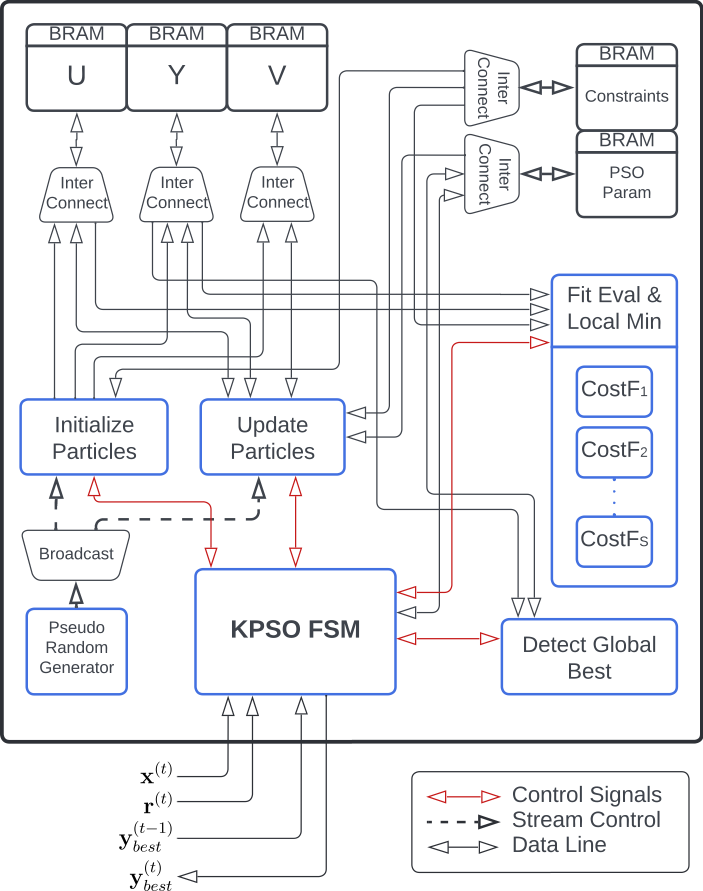

# NMPC Controller with PSO Hardware Acceleration

This repository implements a hardware-accelerated Nonlinear Model Predictive Controller (NMPC) based on Particle Swarm Optimization (PSO). The project includes both high-level MATLAB simulation code and synthesizable C++ code for Vivado HLS targeting FPGA deployment. It supports multiple systems such as the **Inverted Pendulum** and the **Sniffbot quadrotor**.

---

## NMPC Accelerator Hardware Architecture

---

## Subdirectories

- `app/matlab_ws`: MATLAB simulations for inverted pendulum and quadrotor, with visualizations and comparisons.
- `hw/hls`: HLS source code, CMake-based standalone builds, and scripts for Vivado HLS IP generation.
- `hw/hdl`: TCL scripts to generate Vivado projects, e.g., for PYNQ or Ultra96 platforms.
- `misc/`: Auxiliary tools, fast trigonometric LUTs, and the hardware block diagram.

---

## Documentation

- Vivado HLS instructions: [HLS README](hw/hls/readme.MD)
- Vivado HDL project setup: [HDL README](hw/hdl/readme.MD)
- Standalone builds: [Build Guide](hw/hls/source/readme.MD)

---

## Related Files

- 📜 [CITATION.cff](CITATION.cff) – Please cite our original publication if you use this code.
- 🤝 [CONTRIBUTING.md](CONTRIBUTING.md) – Want to help? Start here.
- ⚖️ [LICENSE](LICENSE) – Licensed under GNU GPL v3.

---

## Author

**Ph.D. Sergio Pertuz**  
TU Dresden, Chair of Adaptive Dynamic Systems  
[ORCID](https://orcid.org/0000-0002-6311-3251)